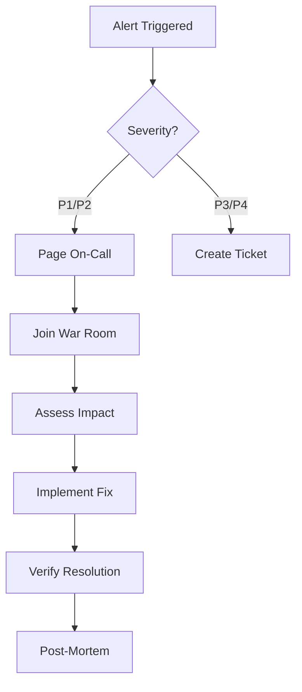

# UnSearch API Operational Runbooks

This document contains step-by-step procedures for handling common operational scenarios and incidents.

## Table of Contents

1. [Emergency Contacts](#emergency-contacts)
2. [Service Health Issues](#service-health-issues)
3. [Performance Degradation](#performance-degradation)
4. [Database Issues](#database-issues)
5. [Cache Issues](#cache-issues)
6. [Search Engine Issues](#search-engine-issues)
7. [Deployment Procedures](#deployment-procedures)
8. [Rollback Procedures](#rollback-procedures)
9. [Scaling Operations](#scaling-operations)
10. [Incident Response](#incident-response)

---

## Emergency Contacts

| Role              | Name                | Contact             | Escalation Time |
| ----------------- | ------------------- | ------------------- | --------------- |
| Primary On-Call   | _to be assigned_    | _your paging tool_  | Immediate       |
| Secondary On-Call | _to be assigned_    | _your paging tool_  | 5 minutes       |
| Engineering Lead  | _to be assigned_    | _email/Slack DM_    | 15 minutes      |
| Platform Team     | _to be assigned_    | _team channel_      | 10 minutes      |
| Database Admin    | _to be assigned_    | _email/Slack DM_    | For DB issues   |
| Security Team     | _to be assigned_    | _security channel_  | For breaches    |

> Fill in the rows above for your deployment. Examples follow as a template only; replace with your own paging tool, status page, and incident-bridge URLs before relying on this runbook.

---

## Service Health Issues

### API Service Down

**Symptoms:**

- Health check endpoint returns non-200 status
- Prometheus alerts firing for `service_down`
- Customer complaints about API unavailability

**Investigation Steps:**

```bash
# 1. Check service status
docker ps | grep unsearch-api
kubectl get pods -n production | grep api

# 2. Check recent logs
docker logs --tail 100 unsearch-api
kubectl logs -n production deployment/api --tail=100

# 3. Check system resources
docker stats unsearch-api
kubectl top pods -n production

# 4. Check dependencies
curl -f http://localhost:8080/health  # SearXNG
redis-cli -h localhost ping           # Redis
pg_isready -h localhost               # PostgreSQL
```

**Resolution Steps:**

```bash
# Option 1: Restart service
docker-compose restart api
# OR
kubectl rollout restart deployment/api -n production

# Option 2: Scale horizontally if under load
docker-compose up -d --scale api=3
# OR
kubectl scale deployment/api --replicas=5 -n production

# Option 3: Emergency failover to backup region
./scripts/failover.sh --region us-west-2
```

**Post-Incident:**

1. Create incident report
2. Update monitoring thresholds
3. Schedule post-mortem meeting

---

### High Error Rate

**Symptoms:**

- Error rate > 5% in Grafana
- Alert: `high_error_rate`
- HTTP 5xx responses increasing

**Investigation Steps:**

```bash
# 1. Check error logs
grep ERROR /var/log/UnSearch/api.log | tail -20

# 2. Check specific error patterns
grep "500 Internal" /var/log/nginx/access.log | awk '{print $7}' | sort | uniq -c

# 3. Check database connections
psql -c "SELECT count(*) FROM pg_stat_activity WHERE state = 'active';"

# 4. Check external service status
curl -f http://searxng:8080/healthz
```

**Resolution Steps:**

```bash
# 1. If database connection pool exhausted
docker-compose exec api python -c "
from app.services.database import get_database_service
import asyncio
db = asyncio.run(get_database_service())
asyncio.run(db.engine.dispose())
"

# 2. If external service failing
# Enable circuit breaker
export CIRCUIT_BREAKER_ENABLED=true
docker-compose restart api

# 3. If specific endpoint failing
# Add to maintenance mode
curl -X POST localhost:8000/admin/maintenance/endpoints \
  -d '{"endpoint": "/api/v1/search", "enabled": false}'
```

---

## Performance Degradation

### High Response Time

**Symptoms:**

- P95 latency > 2 seconds
- Alert: `high_latency`
- User complaints about slow responses

**Investigation Steps:**

```bash
# 1. Check current metrics
curl -s localhost:8000/metrics | grep http_request_duration

# 2. Identify slow queries
psql -c "SELECT query, mean_exec_time FROM pg_stat_statements ORDER BY mean_exec_time DESC LIMIT 10;"

# 3. Check cache hit rate
redis-cli INFO stats | grep hit

# 4. Profile application
python -m cProfile -o profile.stats app/main.py
python -m pstats profile.stats
```

**Resolution Steps:**

```bash
# 1. Increase cache TTL
export CACHE_DEFAULT_TTL=7200
docker-compose restart api

# 2. Optimize slow queries
psql -c "ANALYZE;"  # Update statistics
psql -c "REINDEX DATABASE UnSearch;"  # Rebuild indexes

# 3. Enable query result caching
export QUERY_CACHE_ENABLED=true
docker-compose restart api

# 4. Scale up resources
docker-compose exec api python -c "
from app.config import get_settings
settings = get_settings()
settings.database_pool_size = 20
settings.redis_max_connections = 50
"
```

---

## Database Issues

### Database Connection Failed

**Symptoms:**

- `DatabaseException: connection refused`
- Alert: `postgres_down`

**Investigation Steps:**

```bash
# 1. Check PostgreSQL status
systemctl status postgresql
docker ps | grep postgres

# 2. Check connection limits
psql -c "SHOW max_connections;"
psql -c "SELECT count(*) FROM pg_stat_activity;"

# 3. Check disk space
df -h /var/lib/postgresql

# 4. Check PostgreSQL logs
tail -100 /var/log/postgresql/postgresql-*.log
```

**Resolution Steps:**

```bash
# 1. Restart PostgreSQL
docker-compose restart postgres
# OR
systemctl restart postgresql

# 2. Kill idle connections
psql -c "SELECT pg_terminate_backend(pid) FROM pg_stat_activity WHERE state = 'idle' AND state_change < NOW() - INTERVAL '10 minutes';"

# 3. Increase connection limit
psql -c "ALTER SYSTEM SET max_connections = 200;"
psql -c "SELECT pg_reload_conf();"

# 4. Emergency read-only mode
export DATABASE_READONLY=true
docker-compose restart api
```

### Database Replication Lag

**Symptoms:**

- Replication lag > 10 seconds
- Alert: `replication_lag_high`

**Investigation Steps:**

```bash
# Check replication status
psql -h replica -c "SELECT NOW() - pg_last_xact_replay_timestamp() AS replication_lag;"

# Check WAL status
psql -c "SELECT * FROM pg_stat_replication;"
```

**Resolution Steps:**

```bash
# 1. Pause non-critical background jobs
celery control cancel_consumer celery-worker

# 2. Increase WAL keep segments
psql -c "ALTER SYSTEM SET wal_keep_segments = 100;"

# 3. Manually sync if needed
pg_basebackup -h primary -D /var/lib/postgresql/data -U replicator -v -P -W
```

---

## Cache Issues

### Redis Memory Full

**Symptoms:**

- Redis OOM errors
- Alert: `redis_memory_high`

**Investigation Steps:**

```bash
# 1. Check memory usage
redis-cli INFO memory

# 2. Check key distribution
redis-cli --scan --pattern '*' | head -100

# 3. Check large keys
redis-cli --bigkeys
```

**Resolution Steps:**

```bash
# 1. Clear expired keys
redis-cli FLUSHDB

# 2. Increase memory limit
redis-cli CONFIG SET maxmemory 2gb

# 3. Enable eviction policy
redis-cli CONFIG SET maxmemory-policy allkeys-lru

# 4. Clear specific pattern
redis-cli --scan --pattern 'cache:search:*' | xargs redis-cli DEL
```

---

## Search Engine Issues

### SearXNG Not Responding

**Symptoms:**

- Search requests failing
- `SearXNGException: connection timeout`

**Investigation Steps:**

```bash
# 1. Check SearXNG status
curl http://localhost:8080/healthz

# 2. Check SearXNG logs
docker logs UnSearch-searxng --tail 100

# 3. Test search directly
curl -X POST http://localhost:8080/search \
  -H "Content-Type: application/json" \
  -d '{"q": "test", "engines": ["google"]}'
```

**Resolution Steps:**

```bash
# 1. Restart SearXNG
docker-compose restart searxng

# 2. Clear SearXNG cache
docker-compose exec searxng rm -rf /usr/local/searxng/cache/*

# 3. Disable problematic engines
# Edit searxng/settings.yml
engines:
  - name: google
    disabled: true

# 4. Failover to backup instance
export SEARXNG_URL=http://searxng-backup:8080
docker-compose restart api
```

---

## Deployment Procedures

### Standard Deployment

```bash
#!/bin/bash
# Standard deployment procedure

# 1. Pre-deployment checks
./scripts/pre-deploy-check.sh || exit 1

# 2. Create backup
./scripts/backup.sh

# 3. Deploy to canary (10% traffic)
kubectl set image deployment/api api=ghcr.io/rakesh1002/unsearch:$VERSION -n production
kubectl rollout status deployment/api -n production

# 4. Monitor canary metrics (5 minutes)
sleep 300
./scripts/check-canary-metrics.sh || (kubectl rollout undo deployment/api -n production && exit 1)

# 5. Full deployment
kubectl set image deployment/api api=ghcr.io/rakesh1002/unsearch:$VERSION -n production --all

# 6. Verify deployment
./scripts/post-deploy-check.sh

# 7. Update status page
curl -X POST $STATUS_PAGE_URL/api/incidents \
  -d '{"status": "resolved", "message": "Deployment completed successfully"}'
```

### Emergency Hotfix

```bash
#!/bin/bash
# Emergency hotfix deployment

# 1. Create hotfix branch
git checkout -b hotfix/critical-fix

# 2. Apply fix and test
# ... make changes ...
pytest tests/unit/ -v

# 3. Build and push image
docker build -t UnSearch:hotfix-$(date +%s) .
docker push UnSearch:hotfix-$(date +%s)

# 4. Deploy immediately
kubectl set image deployment/api api=UnSearch:hotfix-$(date +%s) -n production

# 5. Monitor
watch kubectl get pods -n production
```

---

## Rollback Procedures

### Application Rollback

```bash
# 1. Get deployment history
kubectl rollout history deployment/api -n production

# 2. Rollback to previous version
kubectl rollout undo deployment/api -n production

# OR rollback to specific revision
kubectl rollout undo deployment/api --to-revision=42 -n production

# 3. Verify rollback
kubectl rollout status deployment/api -n production

# 4. Check application health
curl http://api.unsearch.dev/health
```

### Database Migration Rollback

```bash
# 1. Check current migration
alembic current

# 2. Rollback one migration
alembic downgrade -1

# OR rollback to specific migration
alembic downgrade 3f146c5f8b12

# 3. Verify schema
psql -c "\dt"
```

---

## Scaling Operations

### Horizontal Scaling

```bash
# Scale up during high load
kubectl scale deployment/api --replicas=10 -n production

# Auto-scaling configuration
kubectl autoscale deployment/api \
  --min=3 \
  --max=20 \
  --cpu-percent=70 \
  -n production
```

### Vertical Scaling

```bash
# Update resource limits
kubectl set resources deployment/api \
  -c api \
  --limits=cpu=2,memory=4Gi \
  --requests=cpu=1,memory=2Gi \
  -n production
```

---

## Incident Response

### Incident Classification

| Severity | Description       | Response Time | Examples                       |
| -------- | ----------------- | ------------- | ------------------------------ |
| P1       | Complete outage   | < 15 min      | API down, data loss            |
| P2       | Major degradation | < 30 min      | High error rate, slow response |
| P3       | Minor issue       | < 2 hours     | Single feature broken          |
| P4       | Low impact        | < 24 hours    | Cosmetic issues                |

### Incident Response Process



### Incident Commander Checklist

- [ ] Acknowledge incident in PagerDuty
- [ ] Join war room call
- [ ] Assess severity and impact
- [ ] Assign roles (commander, communicator, investigator)
- [ ] Create incident channel in Slack
- [ ] Update status page
- [ ] Coordinate resolution efforts
- [ ] Communicate with stakeholders
- [ ] Verify resolution
- [ ] Schedule post-mortem

### Communication Template

**Initial Response:**

```
We are aware of an issue affecting [SERVICE].
Impact: [DESCRIPTION]
Status: Investigating
Next update: In 30 minutes
```

**Update:**

```
Update on [SERVICE] issue:
Current status: [STATUS]
Actions taken: [ACTIONS]
ETA for resolution: [TIME]
Next update: In [X] minutes
```

**Resolution:**

```
The issue with [SERVICE] has been resolved.
Root cause: [BRIEF DESCRIPTION]
Duration: [START] - [END]
Post-mortem: Will be conducted on [DATE]
```

---

## Monitoring and Alerts

### Key Metrics to Monitor

| Metric         | Warning Threshold | Critical Threshold | Action         |
| -------------- | ----------------- | ------------------ | -------------- |
| API Uptime     | < 99.9%           | < 99.5%            | Check health   |
| Error Rate     | > 1%              | > 5%               | Check logs     |
| P95 Latency    | > 1s              | > 2s               | Scale/optimize |
| CPU Usage      | > 70%             | > 90%              | Scale up       |
| Memory Usage   | > 80%             | > 95%              | Restart/scale  |
| DB Connections | > 80%             | > 95%              | Increase pool  |
| Cache Hit Rate | < 80%             | < 60%              | Check cache    |
| Queue Length   | > 1000            | > 5000             | Scale workers  |

### Alert Response Matrix

| Alert                          | First Action          | Escalation      | Documentation                            |
| ------------------------------ | --------------------- | --------------- | ---------------------------------------- |
| `api_down`                     | Check pods/containers | Page on-call    | [Service Health](#service-health-issues) |
| `high_error_rate`              | Check recent deploys  | Check logs      | [High Error Rate](#high-error-rate)      |
| `high_latency`                 | Check DB queries      | Scale services  | [Performance](#performance-degradation)  |
| `db_connection_pool_exhausted` | Kill idle connections | Restart API     | [Database](#database-issues)             |
| `redis_memory_full`            | Clear expired keys    | Increase memory | [Cache](#cache-issues)                   |
| `disk_space_low`               | Clean logs/temp       | Add storage     | [Disk Management](#disk-management)      |

---

## Maintenance Procedures

### Scheduled Maintenance

```bash
# 1. Schedule maintenance window
./scripts/schedule-maintenance.sh --start "2024-01-15 02:00" --duration 2h

# 2. Enable maintenance mode
curl -X POST http://api/admin/maintenance/enable \
  -H "Authorization: Bearer $ADMIN_TOKEN"

# 3. Perform maintenance tasks
# ... updates, migrations, etc ...

# 4. Disable maintenance mode
curl -X POST http://api/admin/maintenance/disable \
  -H "Authorization: Bearer $ADMIN_TOKEN"

# 5. Verify services
./scripts/post-maintenance-check.sh
```

### Log Rotation

```bash
# Rotate application logs
logrotate -f /etc/logrotate.d/UnSearch

# Clean old logs
find /var/log/UnSearch -name "*.log.gz" -mtime +30 -delete

# Archive to S3
aws s3 sync /var/log/UnSearch s3://UnSearch-logs/$(date +%Y/%m)/
```

---

## Disaster Recovery

### Full System Recovery

```bash
# 1. Provision new infrastructure
terraform apply -var-file=dr.tfvars

# 2. Restore database from backup
./scripts/restore.sh postgres /backups/latest/postgres.sql.gz

# 3. Restore Redis data
./scripts/restore.sh redis /backups/latest/redis.rdb.gz

# 4. Deploy application
kubectl apply -f k8s/production/

# 5. Update DNS
./scripts/update-dns.sh --target dr-region

# 6. Verify functionality
./scripts/dr-verification.sh
```

### Data Recovery

```bash
# Point-in-time recovery
pg_restore --dbname=UnSearch \
  --time="2024-01-14 15:30:00" \
  /backups/continuous/base.tar

# Recover deleted records
psql -c "
  SELECT * FROM deleted_records
  WHERE deleted_at > NOW() - INTERVAL '1 hour'
  INTO OUTFILE '/tmp/recovered.csv';
"
```

---

## Appendix

### Useful Commands

```bash
# View real-time logs
stern api -n production --tail 50

# Database query analysis
psql -c "EXPLAIN ANALYZE SELECT ..."

# Redis memory analysis
redis-cli MEMORY DOCTOR

# Network debugging
tcpdump -i any -w capture.pcap host api.unsearch.dev

# Process monitoring
htop -p $(pgrep -f uvicorn)
```

### Environment URLs

| Environment | API URL                       | Admin URL                       | Monitoring                  |
| ----------- | ----------------------------- | ------------------------------- | --------------------------- |
| Production  | https://api.unsearch.dev      | _your admin URL_                | _your Grafana URL_          |
| Staging     | _your staging API URL_        | _your staging admin URL_        | _your staging Grafana URL_  |
| Development | http://localhost:8000         | http://localhost:8000/admin     | http://localhost:3000       |

### Support Resources

- **Documentation**: https://docs.unsearch.dev
- **Repository**: https://github.com/Rakesh1002/unsearch
- **API Status**: _your status page URL_
- **Internal Wiki**: _your wiki URL_
- **Chat**: _your team channel_
- **Issue Tracker**: _your tracker URL (Linear/Jira/GitHub Issues)_
